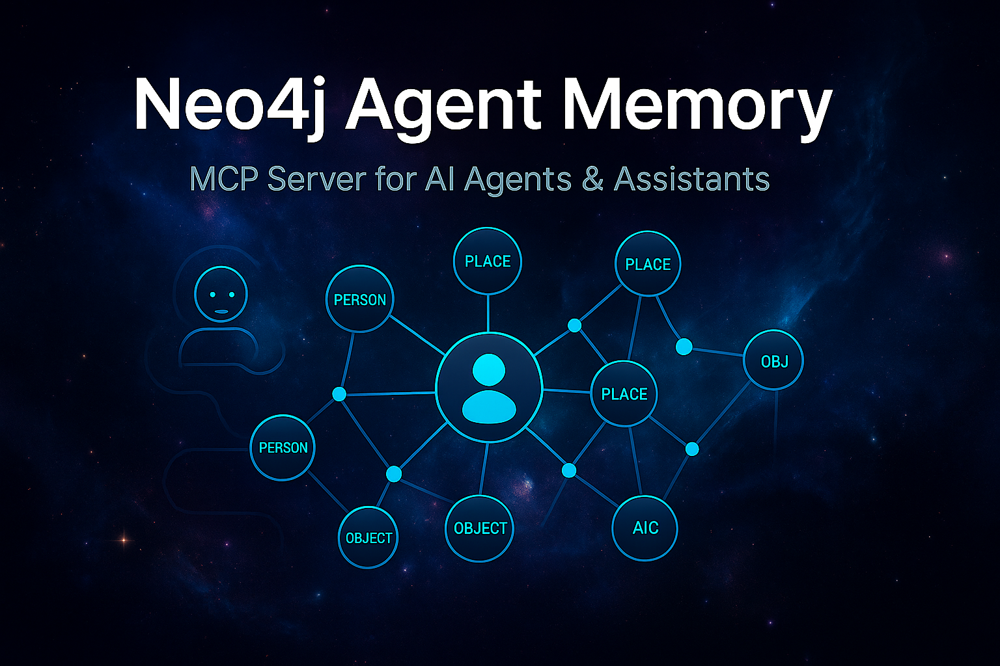

# Neo4j Agent Memory MCP Server



A specialized MCP server that bridges Neo4j graph database with AI agents, providing memory-focused tools for storing, recalling, and connecting information in a knowledge graph.

## Quick Start 🚀

You can run this MCP server directly using npx:

```bash
npx @knowall-ai/mcp-neo4j-agent-memory
```

Or add it to your Claude Desktop configuration:

```json
{
  "mcpServers": {
    "neo4j-memory": {
      "command": "npx",
      "args": ["@knowall-ai/mcp-neo4j-agent-memory"],
      "env": {
        "NEO4J_URI": "bolt://localhost:7687",
        "NEO4J_USERNAME": "neo4j",
        "NEO4J_PASSWORD": "your-password",
        "NEO4J_DATABASE": "neo4j"
      }
    }
  }
}
```

## Features

- 🧠 **Persistent Memory Storage** - Store and retrieve memories across conversations
- 🔗 **Semantic Relationships** - Create meaningful connections between memories (KNOWS, WORKS_AT, CREATED, etc.)
- 🔍 **Intelligent Search** - Natural language search across all memory properties and relationships
- 🏷️ **Flexible Labeling** - Use any label for memories (person, place, project, idea, etc.)
- ⏰ **Temporal Tracking** - Automatic timestamps and date-based queries
- 🌐 **Graph Exploration** - Traverse relationships to discover connected information
- 🎯 **Context-Aware** - Search with depth to include related memories
- 🔧 **LLM-Optimized** - Simple tools that let the AI handle the complexity
- 🏢 **Enterprise Ready** - Supports multiple Neo4j databases
- 📚 **Built-in Guidance** - Get help on best practices and usage patterns

## Philosophy: LLM-Driven Intelligence

Unlike traditional approaches that embed complex logic in tools, this server provides simple, atomic operations and lets the LLM handle all the intelligence:

- **No hidden logic**: Tools do exactly what they say - no auto-disambiguation or smart matching
- **LLM decides everything**: Entity recognition, relationship inference, and conflict resolution
- **Transparent operations**: Every action is explicit and predictable
- **Maximum flexibility**: The LLM can implement any strategy without tool limitations

### Search Behavior
The `search_memories` tool uses word tokenization:
- Query "John Smith" finds memories containing "John" OR "Smith"
- This returns more results, letting the LLM pick the most relevant
- Better than exact substring matching for names and multi-word queries

This approach makes the system more powerful and adaptable, as improvements in LLM capabilities directly translate to better memory management.

### Neo4j Enterprise Support

This server now supports connecting to specific databases in Neo4j Enterprise Edition. By default, it connects to the "neo4j" database, but you can specify a different database using the `NEO4J_DATABASE` environment variable.

### Memory Tools

- `search_memories`: Search and retrieve memories from the knowledge graph
  - **Word-based search**: Searches for ANY word in your query (e.g., "Ben Weeks" finds memories containing "Ben" OR "Weeks")
  - Natural language search across all memory properties (or leave empty to get all)
  - Filter by memory type (person, place, project, etc.)
  - Filter by date with `since_date` parameter (ISO format)
  - Control relationship depth and result limits
  - Sort by any field (created_at, name, etc.)

- `create_memory`: Create a new memory in the knowledge graph
  - Flexible type system - use any label in lowercase (person, place, project, skill, etc.)
  - Store any properties as key-value pairs
  - Automatic timestamps for temporal tracking

- `create_connection`: Create relationships between memories
  - Link memories using semantic relationship types (KNOWS, WORKS_AT, LIVES_IN, etc.)
  - Add properties to relationships (since, role, status, etc.)
  - Build complex knowledge networks

- `update_memory`: Update properties of existing memories
  - Add or modify any property
  - Set properties to null to remove them

- `update_connection`: Update relationship properties
  - Modify relationship metadata
  - Track changes over time

- `delete_memory`: Remove memories and all their connections
  - Use with caution - permanent deletion
  - Automatically removes all relationships

- `delete_connection`: Remove specific relationships
  - Precise relationship removal
  - Keeps the memories intact

- `list_memory_labels`: List all unique memory labels in use
  - Shows all labels with counts
  - Helps maintain consistency
  - Prevents duplicate label variations

- `get_guidance`: Get help on using the memory tools effectively
  - Topics: labels, relationships, best-practices, examples
  - Returns comprehensive guidance for LLMs
  - Use when uncertain about label/relationship naming

## Prerequisites

1. **Neo4j Database** (v4.4+ or v5.x)
   - Install Neo4j Community or Enterprise Edition
   - Download from [neo4j.com/download](https://neo4j.com/download/)
   - Or use Docker: `docker run -p 7474:7474 -p 7687:7687 -e NEO4J_AUTH=neo4j/password neo4j`

2. **Node.js** (v18 or higher)
   - Required to run the MCP server
   - Download from [nodejs.org](https://nodejs.org/)

3. **Claude Desktop** (for MCP integration)
   - Download from [claude.ai/download](https://claude.ai/download)

## Installation

### Installing via Smithery

[](https://smithery.ai/server/@knowall-ai/mcp-neo4j-agent-memory)

To install Neo4j Agent Memory MCP Server for Claude Desktop automatically via [Smithery](https://smithery.ai/server/@knowall-ai/mcp-neo4j-agent-memory):

```bash
npx -y @smithery/cli install @knowall-ai/mcp-neo4j-agent-memory --client claude
```

### For Development

1. Clone the repository:
```bash
git clone https://github.com/KnowAll-AI/mcp-neo4j-agent-memory.git
cd mcp-neo4j-agent-memory
```

2. Install dependencies:
```bash
npm install
```

3. Build the project:
```bash
npm run build
```

## Configuration

### Environment Variables

The server requires the following environment variables:

- `NEO4J_URI`: Neo4j database URI (required, e.g., bolt://localhost:7687)
- `NEO4J_USERNAME`: Neo4j username (required)
- `NEO4J_PASSWORD`: Neo4j password (required)
- `NEO4J_DATABASE`: Neo4j database name (optional) - For Neo4j Enterprise with multiple databases

### Setting up Environment Variables

#### For Development
Copy `.env.example` to `.env` and update with your credentials:
```bash
cp .env.example .env
# Edit .env with your Neo4j credentials
```

#### For Claude Desktop
Add the environment variables to your Claude Desktop configuration (see Quick Start above).

## Usage Examples

The LLM handles all the complexity of deciding what to store and how to connect memories:

#### Storing Information
```
User: "Remember that John works at Google as a software engineer"

Assistant: I'll remember that John works at Google as a software engineer.

[Behind the scenes, the LLM does:
1. search_memories({"query": "John"}) - Check if John exists
2. search_memories({"query": "Google"}) - Check if Google exists
3. create_memory({"label": "Person", "properties": {"name": "John", "occupation": "software engineer"}})
4. create_memory({"label": "Organization", "properties": {"name": "Google"}})
5. create_connection({"fromMemoryId": 123, "toMemoryId": 456, "type": "WORKS_AT"})]

User: "Remember that Sarah is John's manager and she started in 2019"

Assistant: I'll add that information about Sarah.

[The LLM searches for John, creates Sarah, and connects them with a MANAGES relationship including the start date]
```

#### Retrieving Information
```
User: "Who works at Google?"

Assistant: Let me search for people who work at Google.

[LLM uses: search_memories({"query": "Google", "depth": 2})]

Based on my memory:
- John - Software Engineer at Google
- Sarah - Manager at Google (manages John, started 2019)

User: "What do you remember about John?"

Assistant: Here's what I know about John:

[LLM uses: search_memories({"query": "John", "depth": 2})]

- Works at Google as a Software Engineer
- Sarah is his manager
- [Any other connected memories found in the search]
```

#### Building Relationships
```
User: "John and Sarah are working on Project Atlas together"

Assistant: I'll connect John and Sarah to Project Atlas.

[The LLM:
1. Searches for John and Sarah to get their IDs
2. Creates Project Atlas: create_memory({"label": "Project", "properties": {"name": "Project Atlas"}})
3. Connects them: create_connection({"fromMemoryId": johnId, "toMemoryId": projectId, "type": "WORKS_ON"})
4. create_connection({"fromMemoryId": sarahId, "toMemoryId": projectId, "type": "WORKS_ON"})]
```

### Connecting to a Specific Database

For Neo4j Enterprise users with multiple databases, you can specify which database to connect to:

```json
{
  "env": {
    "NEO4J_URI": "bolt://localhost:7687",
    "NEO4J_USERNAME": "neo4j",
    "NEO4J_PASSWORD": "your-password",
    "NEO4J_DATABASE": "myCustomDatabase"
  }
}
```

This will connect to "myCustomDatabase" instead of the default "neo4j" database.

### More Complex Examples

#### Finding Related Information
```
User: "Show me all employees in the Sales department"

Assistant: Let me search for employees in the Sales department.

[LLM uses: search_memories({"query": "Sales department", "depth": 2})]

I found these employees in the Sales department:
- John Smith (Sales Manager)
- Sarah Johnson (Sales Representative)  
- Mike Brown (Account Executive)
```

#### Creating Domain-Specific Memories
```
User: "Create a product called 'Premium Coffee' with price $24.99"

Assistant: I'll create that product for you.

[LLM uses: create_memory({"label": "Product", "properties": {"name": "Premium Coffee", "price": 24.99}})]

Created Premium Coffee product with ID: 456
```

#### Managing Relationships
```
User: "The Premium Coffee uses beans from our Colombian Supplier"

Assistant: I'll connect Premium Coffee to the Colombian Supplier.

[LLM:
1. search_memories({"query": "Premium Coffee"})
2. search_memories({"query": "Colombian Supplier"})
3. create_connection({"fromMemoryId": 456, "toMemoryId": 789, "type": "SUPPLIED_BY"})]

Connected Premium Coffee to Colombian Supplier
```

### Advanced Queries

The LLM can handle complex queries by intelligently using the search tools:

#### Word-Based Search
```
User: "Find Ben Weeks"

Assistant: I'll search for memories containing "Ben" or "Weeks".

[LLM uses: search_memories({"query": "Ben Weeks"})]

I found several people matching your search:
- Ben Weeks - Software Engineer at TechCorp (exact match)
- Sarah Ben - Data Scientist at DataCo (contains "Ben")
- John Weeks - Project Manager (contains "Weeks")

The most likely match appears to be Ben Weeks, the Software Engineer.
```

Note: The search finds ANY word from your query, allowing the LLM to present all potentially relevant results and identify the best match based on context.

#### Recent Memories (Last 7 Days)
```
User: "What new people have I met in the last week?"

Assistant: I'll search for people added to your memory in the last 7 days.

[LLM calculates the date 7 days ago and uses: 
search_memories({
  "query": "", 
  "label": "person", 
  "since_date": "2024-01-20T00:00:00Z",
  "order_by": "created_at DESC"
})]

Here are the new people you've met in the last week:
- Sarah Chen - Met at tech conference on Monday
- Dr. Michael Roberts - New physician, first appointment Tuesday  
- Emma Wilson - Joined your project team on Wednesday
- James Park - Coffee meeting about potential collaboration Thursday
```

#### Disambiguation
```
User: "What does John do?"

Assistant: I found multiple people named John. Let me show you what I know:

[LLM uses: search_memories({"query": "John", "type": "Person", "depth": 1})]

1. John Doe - Software Engineer at Google
2. John Smith - Sales Manager in Sales Department
3. John Brown - Project Manager on Project Atlas

Which John were you asking about?
```

#### Temporal Queries
```
User: "What events did I attend last month?"

Assistant: I'll search for event memories and check their dates.

[LLM uses: search_memories({"query": "", "label": "event", "sort_by": "created_at", "sort_order": "desc"})]

[Filters results to last month based on created_at or date properties]

Here are the events you attended last month:
- Tech Innovation Summit (March 5-6) - Keynote speaker
- Team Building Workshop (March 12) - With engineering team
- Client Dinner Meeting (March 18) - Project kickoff with ABC Corp
- WebDev Conference (March 25-27) - Attended 5 sessions on React
```

### Flexible Memory Types

The system doesn't enforce strict types - you can create any type of memory that makes sense:

**Common Types** (lowercase): person, place, organization, project, event, topic, object, animal, plant, food, activity, media, skill, document, meeting, task, habit, health, vehicle, tool, idea, goal

**But you can use any type** (lowercase): recipe, dream, memory, quote, book, movie, emotion, relationship, appointment, medication, exercise, symptom, payment, contract, etc.

The LLM will intelligently reuse existing types when appropriate to maintain consistency.

### The Power of Connections

The true value of this memory system lies not just in storing individual memories, but in **creating connections between them**. A knowledge graph becomes exponentially more useful as you build relationships:

#### Why Connections Matter

- **Context Discovery**: Connected memories provide rich context that isolated facts cannot
- **Relationship Patterns**: Reveal hidden patterns and insights through relationship analysis  
- **Temporal Understanding**: Track how relationships evolve over time
- **Network Effects**: Each new connection increases the value of existing memories

#### Best Practices for Building Connections

1. **Always look for relationships** when storing new information:
   ```
   Bad: Just store "John is a developer"
   Good: Store John AND connect him to his company, projects, skills, and colleagues
   ```

2. **Use semantic relationship types** that capture meaning:
   ```
   WORKS_AT, MANAGES, KNOWS, LIVES_IN, CREATED, USES, LEARNED_FROM
   ```

3. **Add relationship properties** for richer context:
   ```
   create_connection({
     "fromMemoryId": 123,
     "toMemoryId": 456, 
     "type": "WORKS_ON",
     "properties": {"role": "Lead", "since": "2023-01", "hours_per_week": 20}
   })
   ```

4. **Think in graphs**: When recalling information, use depth > 1 to explore the network:
   ```
   search_memories({"query": "John", "depth": 3})  // Explores connections up to 3 hops away
   ```

Remember: A memory without connections is like a book in a library with no catalog - it exists, but its utility is limited. The more you connect your memories, the more intelligent and useful your knowledge graph becomes.

## Testing

Run the test suite:

```bash
npm test
```

### Interactive Testing with MCP Inspector

For interactive testing and debugging, use the MCP Inspector:

```bash
# Quick start with environment variables from .env
./run-inspector.sh

# Or manually with specific environment variables
NEO4J_URI=bolt://localhost:7687 \
NEO4J_USERNAME=neo4j \
NEO4J_PASSWORD=your-password \
npx @modelcontextprotocol/inspector build/index.js
```

The inspector provides a web UI to:
- Test all available tools interactively
- See real-time request/response data
- Validate your Neo4j connection
- Debug tool parameters and responses

## License

MIT

---

